

  <h1> SISTEM PENYEWAAN HANDPHONE </h1>

  
  
  

<table>
  <tr>
    <td width="150"><b>Nama</b></td>
    <td>: Rifaa Zainul Arifin</td>
  </tr>
  <tr>
    <td><b>NIM</b></td>
    <td>: 2509116092</td>
  </tr>
  <tr>
    <td><b>Kelas</b></td>
    <td>: C</td>
  </tr>
  <tr>
</table>

# SISTEM SEWA HANDPHONE

## <b>1. Deskripsi Singkat Program</b>

Sistem Sewa Handphone merupakan program berbasis Java yang digunakan untuk mengelola data handphone, data pelanggan, serta proses penyewaan dan pengembalian handphone. Program dijalankan melalui console dan menggunakan <b>ArrayList</b> sebagai tempat penyimpanan data selama program berjalan.

Program dikembangkan menggunakan konsep <b>Object Oriented Programming (OOP)</b> dan menerapkan struktur <b>MVC (Model, View, Controller)</b> agar kode program lebih terstruktur dan setiap class memiliki fungsi yang jelas.

Program memiliki beberapa fitur utama, yaitu:

- <b>Kelola Handphone</b>, digunakan untuk menambah, melihat, mengubah, dan menghapus data handphone.
- <b>Kelola Pelanggan</b>, digunakan untuk menambah, melihat, mengubah, dan menghapus data pelanggan.
- <b>Penyewaan Handphone</b>, digunakan untuk membuat transaksi penyewaan harian atau mingguan.
- <b>Pengembalian Handphone</b>, digunakan untuk menyelesaikan transaksi penyewaan yang masih aktif.
- <b>Riwayat Penyewaan</b>, digunakan untuk melihat seluruh transaksi penyewaan yang pernah dilakukan.

Program juga menerapkan <b>validasi input, access modifier, encapsulation, inheritance, polymorphism, method overriding, ID otomatis, dan dummy data</b>.

---

## <b>2. Struktur Packages Program</b>

Program menerapkan struktur <b>MVC (Model, View, Controller)</b> dengan memisahkan class ke dalam beberapa package agar program lebih rapi dan setiap bagian memiliki tugas masing-masing.

  <b>Gambar 1. Struktur Package Program</b>

   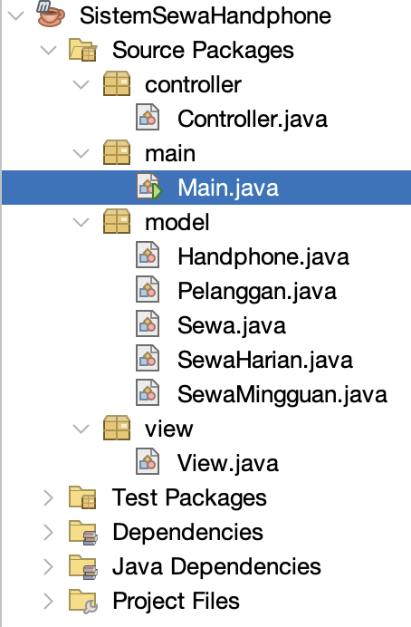

### <b>A. Package Main</b>

Package <b>main</b> berisi class Main yang menjadi titik awal untuk menjalankan program.

Class Main membuat objek Controller dan View, kemudian menjalankan program melalui method jalankan() pada View.

### <b>B. Package Model</b>

Package <b>model</b> berisi class yang digunakan untuk membentuk dan menyimpan data utama program.

Class Handphone digunakan untuk menyimpan data handphone, sedangkan class Pelanggan digunakan untuk menyimpan data pelanggan. Class Sewa digunakan sebagai superclass penyewaan yang kemudian diturunkan menjadi SewaHarian dan SewaMingguan.

Pada bagian Model juga terdapat validasi terhadap atribut masing-masing objek, seperti validasi merk, tipe, harga sewa, nama pelanggan, nomor HP, NIK, status, dan durasi penyewaan.

### <b>C. Package Controller</b>

Package <b>controller</b> berisi class Controller yang digunakan untuk mengatur proses dan data program.

Controller mengelola ArrayList Handphone, Pelanggan, dan Sewa. Controller juga menangani pembuatan ID otomatis, pencarian data, pengecekan data duplikat, proses penyewaan, pengembalian handphone, serta perubahan status data.

Dengan demikian, Controller menjadi penghubung antara data pada Model dengan tampilan dan input yang terdapat pada View.

### <b>D. Package View</b>

Package <b>view</b> berisi class View yang digunakan untuk berinteraksi langsung dengan pengguna melalui console.

View bertugas menampilkan menu, menerima input pengguna, menampilkan data, memberikan pesan validasi, meminta konfirmasi, dan memanggil Controller ketika pengguna ingin melakukan suatu proses.

---

## <b>3. Penjelasan Alur Program</b>

Ketika program pertama kali dijalankan, class Main membuat objek Controller dan View. Controller terlebih dahulu membuat beberapa <b>dummy data</b> Handphone dan Pelanggan sehingga data dapat langsung ditampilkan tanpa harus melakukan input dari awal.

Setelah itu sistem menampilkan dashboard dan Menu Utama.

Menu Utama terdiri dari:
1. Kelola Handphone
2. Kelola Pelanggan
3. Penyewaan Handphone
4. Pengembalian Handphone
5. Riwayat Penyewaan
0. Keluar

Dashboard juga menampilkan informasi jumlah handphone, jumlah handphone tersedia, handphone yang sedang disewa, jumlah pelanggan, dan jumlah transaksi sewa aktif.

  <b>Gambar 2. Menu Utama</b>

   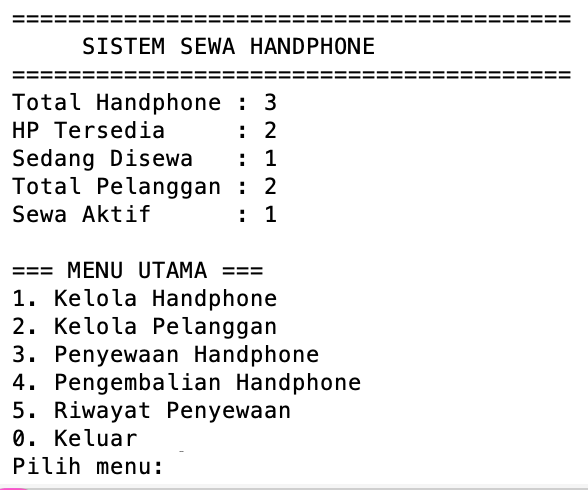

---

### <b>3.1 Alur Kelola Handphone</b>

Menu Kelola Handphone digunakan untuk mengelola seluruh data handphone yang tersedia pada sistem.

Menu ini terdiri dari:

1. Tambah Handphone
2. Lihat Handphone
3. Ubah Handphone
4. Hapus Handphone
0. Kembali

  <b>Gambar 3. Menu Kelola Handphone</b>

   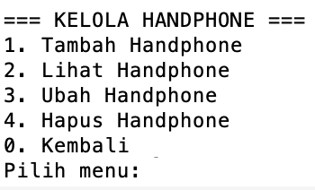

#### <b>A. Tambah Handphone</b>

Pada proses tambah handphone, pengguna memasukkan merk, tipe, dan harga sewa per hari. Kode HP tidak perlu dimasukkan secara manual karena dibuat secara otomatis oleh sistem dengan format seperti HP001, HP002, dan seterusnya.

Input akan diperiksa terlebih dahulu melalui validasi pada class Handphone. Setelah seluruh data valid, sistem meminta konfirmasi sebelum data disimpan ke dalam ArrayList.

  <b>Gambar 4. Proses Tambah Handphone</b>

   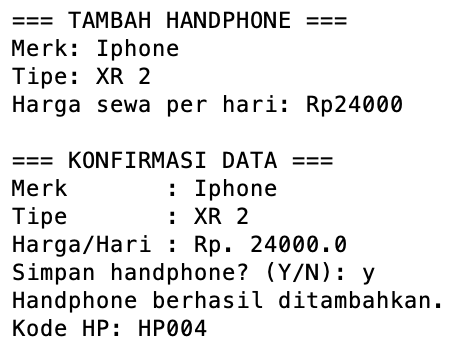

#### <b>B. Lihat Handphone</b>

Menu Lihat Handphone menampilkan seluruh data handphone yang tersimpan di dalam sistem. Informasi yang ditampilkan meliputi kode HP, merk, tipe, harga sewa per hari, dan status handphone.

Status awal handphone adalah <b>TERSEDIA</b>.

  <b>Gambar 5. Daftar Handphone</b>

   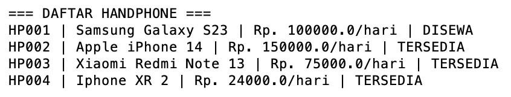

#### <b>C. Ubah Handphone</b>

Pada proses ubah data, pengguna memilih handphone berdasarkan kode HP. Sistem akan mencari handphone tersebut kemudian menampilkan data saat ini.

Pengguna dapat mengubah merk, tipe, dan harga sewa. Handphone yang sedang berstatus <b>DISEWA</b> tidak dapat diubah sampai handphone tersebut dikembalikan.

  <b>Gambar 6. Proses Ubah Handphone</b>

   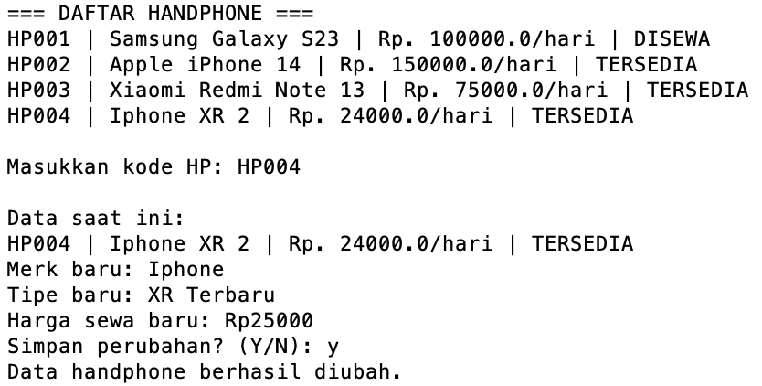

#### <b>D. Hapus Handphone</b>

Pengguna memilih handphone yang ingin dihapus berdasarkan kode HP. Sebelum penghapusan dilakukan, sistem akan meminta konfirmasi.

Handphone yang sudah mempunyai riwayat penyewaan tidak dapat dihapus karena data tersebut masih digunakan dalam riwayat transaksi.

  <b>Gambar 7. Proses Hapus Handphone</b>

   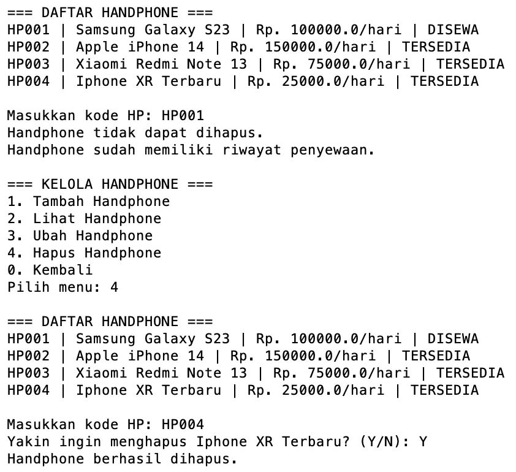

---

### <b>3.2 Alur Kelola Pelanggan</b>

Menu Kelola Pelanggan digunakan untuk mengelola data pelanggan yang menggunakan layanan penyewaan handphone.

Menu ini terdiri dari:

1. Tambah Pelanggan
2. Lihat Pelanggan
3. Ubah Pelanggan
4. Hapus Pelanggan
0. Kembali

  <b>Gambar 8. Menu Kelola Pelanggan</b>

   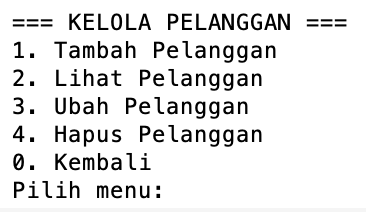

#### <b>A. Tambah Pelanggan</b>

Pengguna memasukkan nama, nomor HP, dan NIK pelanggan. ID pelanggan tidak dimasukkan secara manual karena dibuat otomatis oleh sistem dengan format P001, P002, dan seterusnya.

Sistem melakukan validasi nama, nomor HP, dan NIK. Nomor HP harus diawali '08', sedangkan NIK harus terdiri dari 16 digit. Sistem juga mencegah nomor HP dan NIK yang sama digunakan oleh pelanggan lain.

  <b>Gambar 9. Proses Tambah Pelanggan</b>

   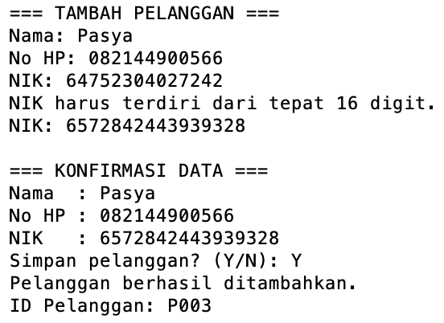

#### <b>B. Lihat Pelanggan</b>

Menu Lihat Pelanggan menampilkan seluruh pelanggan yang telah tersimpan di dalam ArrayList.

Informasi yang ditampilkan meliputi ID pelanggan, nama, nomor HP, dan NIK.

  <b>Gambar 10. Daftar Pelanggan</b>
   
   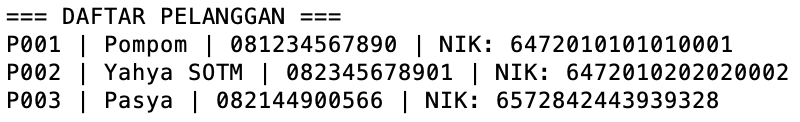

#### <b>C. Ubah Pelanggan</b>

Pengguna memilih pelanggan berdasarkan ID. Setelah pelanggan ditemukan, pengguna dapat mengubah nama, nomor HP, dan NIK.

Data baru tetap melalui proses validasi dan sistem memastikan nomor HP maupun NIK tidak digunakan oleh pelanggan lainnya.

  <b>Gambar 11. Proses Ubah Pelanggan</b>
   
   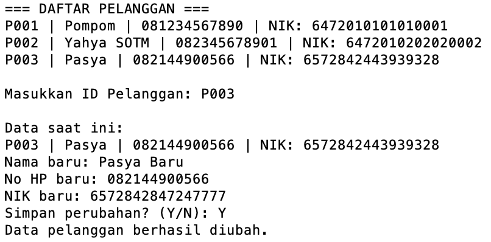

#### <b>D. Hapus Pelanggan</b>

Pengguna memilih pelanggan berdasarkan ID kemudian sistem meminta konfirmasi sebelum penghapusan.

Pelanggan yang sudah memiliki riwayat penyewaan tidak dapat dihapus agar data pada riwayat transaksi tetap terjaga.

  <b>Gambar 12. Proses Hapus Pelanggan</b>

   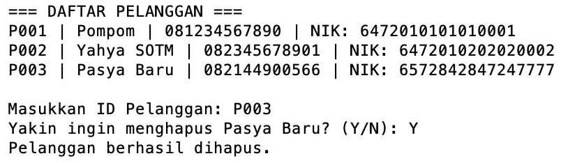

---

### <b>3.3 Alur Penyewaan Handphone</b>

Menu Penyewaan Handphone digunakan untuk membuat transaksi penyewaan baru.

Pada proses ini, sistem terlebih dahulu menampilkan daftar pelanggan. Pengguna memilih pelanggan menggunakan <b>ID Pelanggan</b>.

Setelah pelanggan dipilih, sistem menampilkan handphone yang berstatus <b>TERSEDIA</b>. Pengguna kemudian memilih handphone berdasarkan kode HP.

Selanjutnya pengguna memilih jenis penyewaan:

- <b>Sewa Harian</b>, dengan durasi 1 sampai 6 hari.
- <b>Sewa Mingguan</b>, dengan durasi 1 sampai 4 minggu dan mendapatkan diskon 10%.

Setelah jenis dan durasi dipilih, sistem menghitung total biaya penyewaan secara otomatis dan menampilkan detail transaksi untuk dikonfirmasi.

Jika penyewaan dikonfirmasi, sistem membuat ID sewa secara otomatis dengan format seperti 'SW001', menyimpan transaksi ke dalam ArrayList Sewa, dan mengubah status handphone dari <b>TERSEDIA</b> menjadi <b>DISEWA</b>.

  <b>Gambar 13. Konfirmasi Penyewaan Handphone</b>
   
   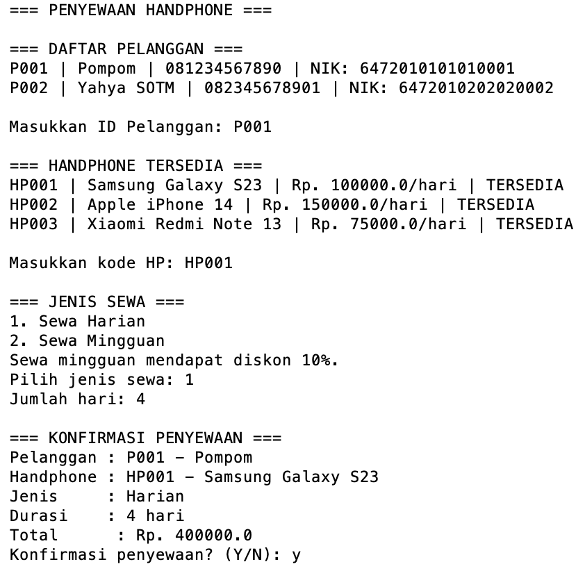

  <b>Gambar 14. Penyewaan Handphone Berhasil</b>

   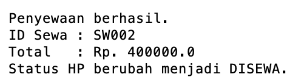

---

### <b>3.4 Alur Pengembalian Handphone</b>

Menu Pengembalian Handphone digunakan untuk menyelesaikan transaksi yang masih berstatus <b>AKTIF</b>.

Sistem terlebih dahulu menampilkan daftar penyewaan aktif. Pengguna memilih transaksi berdasarkan ID Sewa.

Setelah transaksi ditemukan, sistem menampilkan detail penyewaan yang terdiri dari ID Sewa, pelanggan, handphone, jenis sewa, durasi, dan total biaya.

Setelah pengguna melakukan konfirmasi pengembalian, status transaksi berubah dari <b>AKTIF</b> menjadi <b>SELESAI</b> dan status handphone berubah dari <b>DISEWA</b> kembali menjadi <b>TERSEDIA</b>.

Dengan demikian, handphone tersebut dapat digunakan kembali untuk transaksi penyewaan berikutnya.

  <b>Gambar 15. Konfirmasi Pengembalian Handphone</b>

   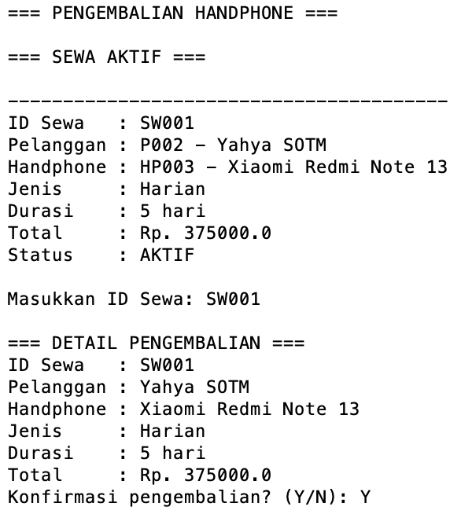

  <b>Gambar 16. Pengembalian Handphone Berhasil</b>

   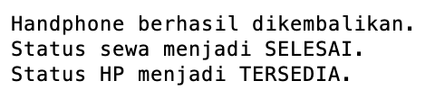

---

### <b>3.5 Alur Riwayat Penyewaan</b>

Menu Riwayat Penyewaan digunakan untuk melihat seluruh transaksi penyewaan yang pernah dilakukan.

Informasi yang ditampilkan terdiri dari ID Sewa, pelanggan, handphone, jenis penyewaan, durasi, total biaya, dan status transaksi.

Transaksi yang belum dikembalikan memiliki status <b>AKTIF</b>, sedangkan transaksi yang sudah melalui proses pengembalian memiliki status <b>SELESAI</b>.

Riwayat transaksi tetap disimpan meskipun handphone sudah dikembalikan.

  <b>Gambar 17. Riwayat Penyewaan</b>

   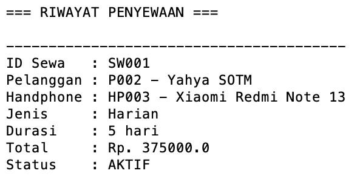

---

### <b>3.6 Keluar Program</b>

Jika pengguna memilih menu '0. Keluar', sistem akan menghentikan perulangan Menu Utama dan menampilkan pesan:

    Terima kasih.
    Program selesai.

Setelah itu program selesai dijalankan.

---

## <b>4. Penerapan Encapsulation</b>

Program menerapkan <b>encapsulation</b> dengan membuat atribut pada setiap class menggunakan access modifier 'private'.

Contohnya pada class 'Pelanggan', atribut ID pelanggan, nama, nomor HP, dan NIK tidak dapat diakses secara langsung dari class lain.

Akses terhadap data dilakukan menggunakan method <b>getter</b>, sedangkan perubahan data dilakukan melalui <b>setter</b>.

Setter juga dilengkapi dengan validasi sehingga data yang dimasukkan harus sesuai dengan aturan yang telah ditentukan.

Beberapa contoh aturan validasi yang diterapkan adalah:

- Nama pelanggan harus terdiri dari 3-50 karakter dan hanya berisi huruf serta spasi.
- Nomor HP harus diawali '08' dan terdiri dari 10-15 digit.
- NIK harus terdiri dari tepat 16 digit angka.
- Merk handphone harus terdiri dari 2-30 karakter.
- Tipe handphone harus terdiri dari 2-50 karakter.
- Harga sewa harus berada antara Rp1.000 sampai Rp10.000.000.
- Status handphone hanya dapat berupa 'TERSEDIA' atau 'DISEWA'.

Atribut seperti 'kodeHP' dan 'idPelanggan' juga menggunakan 'final' karena ID tersebut tidak boleh berubah setelah objek dibuat.

  <b>Gambar 18. Penerapan Encapsulation pada Pelanggan</b>

   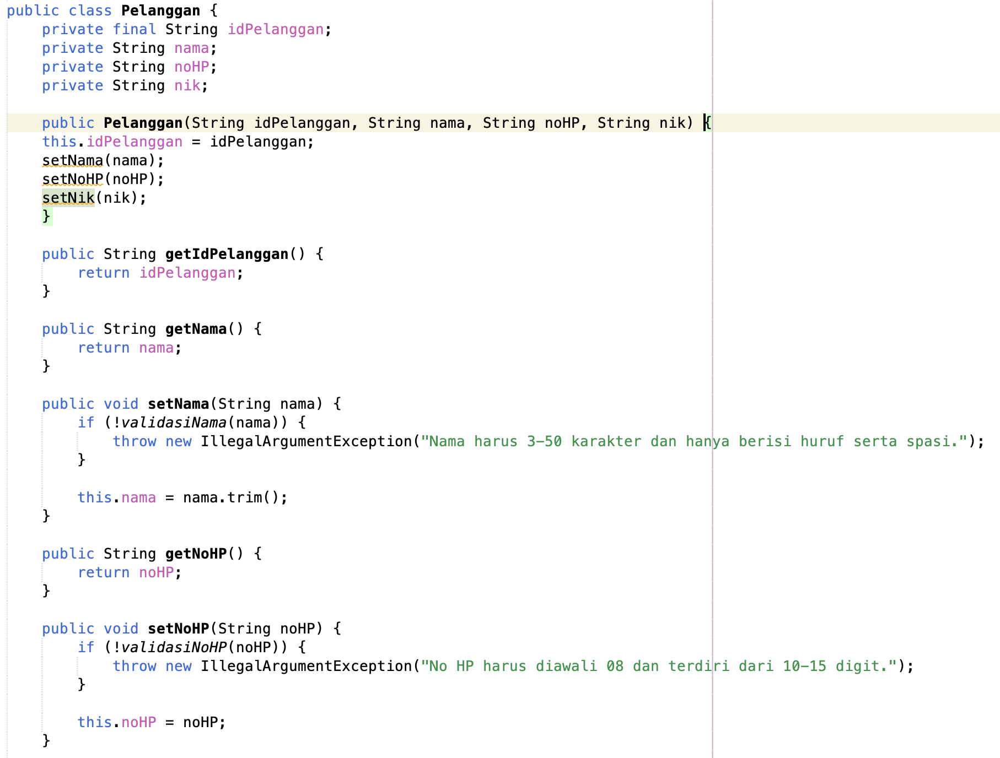
   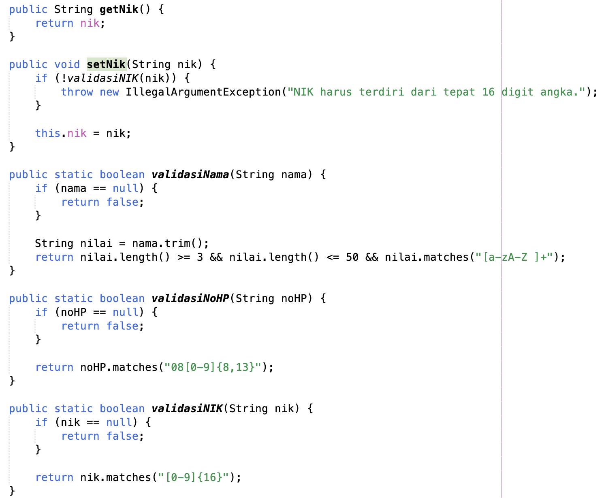

---

## <b>5. Penerapan Inheritance</b>

Program menerapkan <b>inheritance</b> pada proses penyewaan.

Class 'Sewa' digunakan sebagai <b>superclass</b> dan memiliki dua subclass, yaitu:

- 'SewaHarian'
- 'SewaMingguan'

Class 'SewaHarian' dan 'SewaMingguan' menggunakan keyword 'extends Sewa', sehingga keduanya mewarisi atribut dan method yang terdapat pada superclass Sewa.

Data yang diwariskan antara lain:

- ID Sewa
- Pelanggan
- Handphone
- Status
- Total biaya

Walaupun memiliki data dasar yang sama, kedua jenis penyewaan memiliki cara perhitungan biaya dan durasi yang berbeda.

Pada 'SewaHarian', total biaya dihitung berdasarkan:

    Harga sewa per hari × jumlah hari

Sedangkan pada 'SewaMingguan', total biaya dihitung berdasarkan jumlah minggu dan mendapatkan diskon sebesar 10%.

  <b>Gambar 19. Penerapan Inheritance pada Class Sewa</b>

   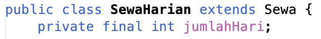
   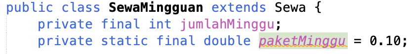

---

## <b>6. Penerapan Polymorphism dan Method Overriding</b>

Program juga menerapkan <b>polymorphism</b> dan <b>method overriding</b> sebagai nilai tambah.

Pada superclass 'Sewa' terdapat beberapa abstract method, yaitu:

- hitungTotal()
- getJenisSewa()
- getDurasi()

Method tersebut kemudian di-override pada class 'SewaHarian' dan 'SewaMingguan' menggunakan '@Override'.

Pada 'SewaHarian', method 'hitungTotal()' menghitung biaya berdasarkan jumlah hari. Sedangkan pada 'SewaMingguan', method yang sama menghitung biaya berdasarkan jumlah minggu dan diskon 10%.

  <b>Gambar 20. Penerapan Polymorphism dan Method Overriding</b>

   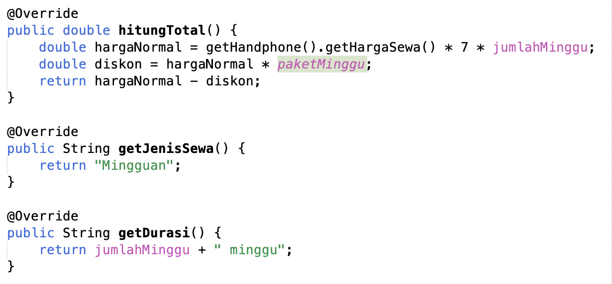

---

## <b>7. Penerapan Validasi Input</b>

Program menerapkan validasi input agar data yang dimasukkan pengguna sesuai dengan aturan sistem dan mengurangi kemungkinan kesalahan input.

Validasi ditempatkan pada class yang sesuai dengan data yang dimiliki.

Pada class 'Handphone' terdapat validasi:
- Merk handphone.
- Tipe handphone.
- Harga sewa.
- Status handphone.

Pada class 'Pelanggan' terdapat validasi:

- Nama pelanggan.
- Nomor HP.
- NIK.

Pada class 'SewaHarian' terdapat validasi jumlah hari penyewaan antara 1 sampai 6 hari.

Pada class 'SewaMingguan' terdapat validasi jumlah minggu penyewaan antara 1 sampai 4 minggu.

Controller juga melakukan pengecekan terhadap hubungan antar data, seperti memastikan nomor HP dan NIK tidak digunakan oleh pelanggan lain, memastikan handphone tersedia sebelum disewa, serta mencegah penghapusan data yang sudah memiliki riwayat penyewaan.

View akan menampilkan pesan apabila input tidak sesuai dan meminta pengguna memasukkan data kembali.

  <b>Gambar 21. Implementasi Validasi Input</b>
   
   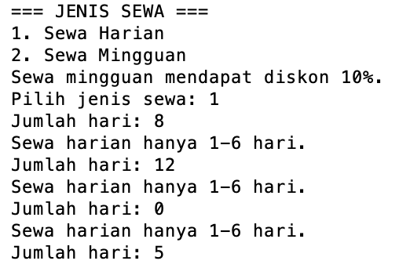

---

## <b>8. Penjelasan MVC dan Polymorphism</b>

### <b>8.1 Struktur MVC</b>

Program menggunakan struktur <b>MVC (Model, View, Controller)</b> sebagai nilai tambah agar kode lebih terstruktur.

<b>Model</b> bertanggung jawab terhadap data dan aturan dari masing-masing objek.

<b>View</b> bertanggung jawab terhadap tampilan menu, crud, menerima input pengguna, menampilkan output, dan memberikan pesan kepada pengguna.

<b>Controller</b> bertanggung jawab mengatur proses program dan menjadi penghubung antara View dengan Model.

<b>Main</b> merupakan program utama dijalankan.

Penerapan MVC membuat setiap class memiliki tanggung jawab yang lebih jelas sehingga program lebih mudah dipahami dan dikembangkan.

---

### <b>8.2 Polymorphism dan Method Overriding</b>

Polymorphism diterapkan melalui superclass 'Sewa' dengan subclass 'SewaHarian' dan 'SewaMingguan'.

Method yang sama dapat memberikan hasil yang berbeda berdasarkan jenis objek penyewaan yaitu pada method overriding yang ditetapkan pada method:
- hitungTotal()
- getJenisSewa()
- getDurasi()

  <b>Gambar 22. Penggunaan Method Overriding</b>
   
   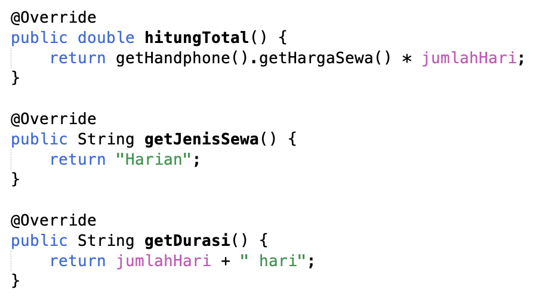
   

---
